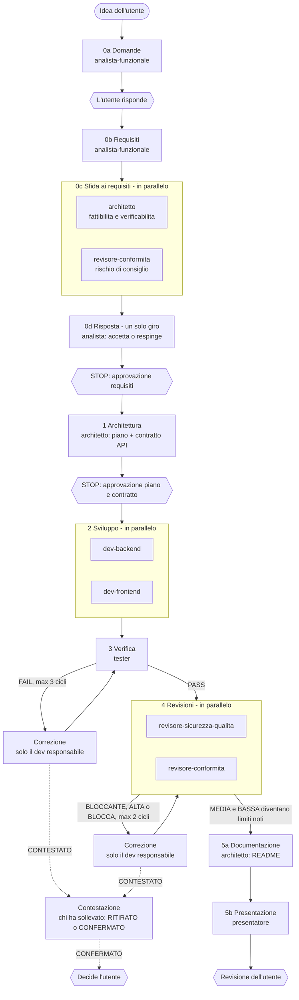

# In tasca mia

App web educativa per il tema **02 – Inclusione finanziaria**. Una persona con poca dimestichezza con i numeri confronta le proprie spese annuali con quelle di persone con un profilo simile. Poi legge, in parole semplici, cosa significano le differenze.

> **L'app educa, non consiglia.** Mostra fatti e spiega concetti. Non dà mai indicazioni su cosa fare con i soldi.
> **Dati dimostrativi**: i dati sono inventati e ispirati all'Indagine ISTAT sulle spese delle famiglie. **Non sono dati ISTAT reali.**
> **Accesso simulato**: login e MFA sono solo dimostrativi. Nessuna password viene salvata o scritta nei log. Lo dicono anche le pagine di login e di conferma.

---

## 1. Problema e persona

**Marco, 34 anni, vive da solo in affitto a Milano (Nord-ovest).** Sa più o meno quanto spende ogni anno per casa, auto, bollette e spesa, ma non ha un termine di paragone. Non sa se le sue spese sono "normali" per una persona come lui. Le statistiche ufficiali sono tabelle lunghe, piene di parole tecniche e non riferite al suo profilo.

Alla fine Marco sa quanto spende in totale e per ciascuna voce, di quanto è sopra, sotto o in linea con la media del suo gruppo, cosa include ogni voce e con chi viene confrontato. Capisce anche che **la media è un riferimento, non un obiettivo**.

## 2. Cosa fa l'app

| Schermata | Cosa succede |
|---|---|
| S-01 Login | Accesso dimostrativo: va bene qualsiasi nome utente e password. |
| S-02 Conferma accesso | MFA simulata: "notifica inviata", conto alla rovescia di 5 secondi, poi accesso confermato. |
| S-04 Profilo | 9 domande caricate dal file dati più le 5 spese annuali (Casa, Sport e tempo libero, Auto e mobilità, Utenze, Spesa). Gli errori compaiono vicino a ogni campo, scritti in tre parti. Il profilo si salva per nome utente. |
| S-03 Analisi di spesa | Ragnatela SVG con "La tua spesa" e "Spesa campione". Accanto c'è un box che cambia con mouse, tastiera, clic o tocco: spesa corrente, spesa campione e 3 frasi "Da sapere". Sotto: "Con chi ti confronti", "Parole utili", disclaimer e fonte. |
| S-05 Amministrazione | Caricamento del file CSV, con il conteggio delle righe lette, importate e scartate e il motivo di ogni scarto. |

Il punteggio del profilo è la somma dei punteggi delle risposte. Il punteggio individua una fascia, e ogni fascia ha una spesa campione per voce. Se il punteggio non cade in nessuna fascia, l'app usa la più vicina e **lo dice**. Una spesa è "in linea" se la differenza resta entro il ±10% della spesa campione. **Tutti i calcoli stanno nel backend.** Il backend restituisce solo codici, e il frontend li traduce nei testi di `app/frontend/src/app/testi.ts`.

Stack: **Spring Boot 4.1.1** (Maven, Java 21) + **Angular** (componenti standalone) + **H2 su file**. Ci sono 6 endpoint REST, descritti in [`agents/docs/contratto-api.md`](agents/docs/contratto-api.md).

## 3. Struttura della consegna

```
app/            soluzione: backend/ (Spring Boot), frontend/ (Angular), avvia.ps1
agents/         struttura agentica: CLAUDE.md, subagents/, skills/, commands/, docs/, stato/, setup.ps1
presentation/   presentazione HTML (index.html, note-relatore.md)
README.md       questo file
```

## 4. Prerequisiti e avvio

**Prerequisiti**: JDK 21 o successivo (testato con JDK 25), Maven 3.9, Node 24, npm. Tutti devono essere nel `PATH`.

1. **Collegamenti della struttura agentica** (serve solo per usare gli agenti con Claude Code). Lo script crea le junction `.claude/agents`, `.claude/skills` e `.claude/commands` che puntano alle cartelle in `agents/`:
   ```powershell
   powershell -ExecutionPolicy Bypass -File agents\setup.ps1
   ```
2. **Avvio dell'app** (dalla radice del repository):
   ```powershell
   powershell -ExecutionPolicy Bypass -File app\avvia.ps1
   ```
   Lo script controlla i prerequisiti e le porte. Al primo avvio installa le dipendenze del frontend. Poi apre backend (porta 8080) e frontend (porta 4200) in due finestre e apre il browser su **http://localhost:4200**.
3. **Arresto**:
   ```powershell
   powershell -ExecutionPolicy Bypass -File app\avvia.ps1 -Ferma
   ```

Il database H2 si trova in `app/backend/data/` ed è escluso da git. Se cancelli questa cartella, con l'app ferma, riparti senza dati.

## 5. Caricare il CSV dimostrativo

1. Dal menu hamburger apri **Amministrazione**.
2. Scegli `agents/skills/formato-csv-istat/esempio_istat.csv` e premi **Carica**.
3. Esito atteso: 66 righe lette, 66 importate, 0 scartate. "Dati attuali" mostra 9 domande e 4 fasce.

Il secondo file, `esempio_istat_errori.csv`, mostra gli scarti: 79 righe lette, 66 importate e 13 scartate, con 9 motivi diversi. Il formato del file (13 colonne, separatore `;`, UTF-8) e tutti i codici di scarto sono descritti in [`agents/skills/formato-csv-istat/SKILL.md`](agents/skills/formato-csv-istat/SKILL.md).

## 6. Percorso demo con il profilo di Marco (RB-23)

1. **Login** con nome utente `marco` e una password qualsiasi. Dopo 5 secondi di MFA simulata si apre il **Profilo**, perché il nome utente è nuovo. Se nessun file è stato ancora caricato, compare il messaggio "Non ci sono ancora dati per il confronto…" (verifica di CA-14).
2. **Amministrazione**: carica `esempio_istat.csv` (sezione 5).
3. **Profilo**: inserisci le risposte Milano, 34, Affitto, M, 28000, Sì, 1, 0, 1. Poi le spese: Casa 12000, Sport e tempo libero 2400, Auto e mobilità 6200, Utenze 5000, Spesa 8000. Per vedere i messaggi di errore prova prima `-100` in Casa, `12.000` in Utenze e Spesa vuota (CA-04).
4. **Analisi di spesa**: punteggio 15, gruppo 14–18 (confronto non approssimato).
   - Totale: 33.600 € contro 33.000 €, in linea con la media.
   - Ramo **Auto e mobilità** (mouse, Tab o clic): 6.200 € contro 5.000 €, "Per Auto e mobilità spendi 1.200 € all'anno in più della media di persone come te. È il 24% in più."
   - Con **Esc** o **"Vedi i totali"** il box torna al totale.
5. **Facoltativo**:
   - con il "profilo fuori fascia" (Milano, 70, Proprietà, F, 150000, No, 3, 2, 6) il punteggio è 21 e compare l'avviso di confronto con il gruppo più vicino (23–25);
   - **Esci** riporta al login;
   - rientrando come `Marco` (con la maiuscola) si arriva direttamente all'analisi.

## 7. Flusso agentico

Gli agenti **costruiscono** l'app: non fanno parte dell'app. La sessione principale fa da orchestratore ed è l'unica che parla con l'utente. Gli agenti non parlano tra loro: ogni confronto passa per un file in `agents/stato/` e prevede **un solo giro**.



Le regole complete (input di ogni fase, limiti dei cicli, protocollo di risposta) sono in [`agents/CLAUDE.md`](agents/CLAUDE.md). Lo stato del progetto è in [`agents/stato/avanzamento.md`](agents/stato/avanzamento.md).

### Agenti

| Agente | Ruolo | Modello | Perché questo modello |
|---|---|---|---|
| `analista-funzionale` | Il **cosa**: requisiti, schermate, regole, criteri di accettazione | opus | Deve ragionare sull'ambiguità e prendere decisioni |
| `architetto` | Il **come**: sfida ai requisiti, piano tecnico, contratto API, README | opus | Deve fare scelte di architettura e mantenere la coerenza tra i documenti |
| `dev-backend` | Codice Spring Boot e test JUnit | sonnet | Produce codice |
| `dev-frontend` | Codice Angular e tutti i testi visibili | sonnet | Produce codice |
| `tester` | **Funziona?** Build, test, criteri di accettazione via HTTP | haiku | Esegue controlli ripetitivi su regole già scritte |
| `revisore-sicurezza-qualita` | **È sicuro e ben fatto?** | sonnet | Fa un'analisi tecnica del codice |
| `revisore-conformita` | **È chiaro e non è un consiglio?** | haiku | Controlla i testi contro regole già scritte |
| `presentatore` | Presentazione HTML con brand Accenture | sonnet | Produce codice HTML e CSS |

### Skill e comandi

| Skill | Contenuto |
|---|---|
| [`formato-csv-istat`](agents/skills/formato-csv-istat/SKILL.md) | Fonte unica del formato del file dati: colonne, ordine dei controlli, codici di scarto, file di esempio e profili attesi |
| [`linguaggio-semplice`](agents/skills/linguaggio-semplice/SKILL.md) | Come si scrive per Marco: massimo 20 parole per frase, espressioni vietate, disclaimer |
| [`verifica-build`](agents/skills/verifica-build/SKILL.md) | Comandi di build, test e avvio su questo PC, lettura degli errori, massimo 3 tentativi |

Comandi slash: `/stato` (fase corrente, problemi aperti, prossimo passo) e `/fase <n>` (avvia una fase dopo aver verificato i prerequisiti).

## 8. Esiti di test e revisioni

| Controllo | Esito | Report |
|---|---|---|
| Sfida ai requisiti (0c → 0d) | 7 obiezioni (6 dell'architetto, 1 della conformità), tutte accettate. Ne sono nati i requisiti v2 | [architetto](agents/stato/sfida-requisiti-architetto.md), [conformità](agents/stato/sfida-requisiti-conformita.md) |
| Verifica, ciclo 2 | 13 CA PASS, 0 FAIL, 1 da verificare in demo (CA-14). Backend: 35/35 test verdi. Build del frontend: OK | [esiti-test.md](agents/stato/esiti-test.md) |
| Sicurezza e qualità, ciclo 1 | 0 BLOCCANTE, 0 ALTA, 1 MEDIA (SQ-01), 0 BASSA | [revisione-sicurezza-qualita.md](agents/stato/revisione-sicurezza-qualita.md) |
| Conformità dei testi, ciclo 1 | Disclaimer e fonte presenti, nessuna espressione vietata. 2 MODIFICA (RC-01 singolare/plurale, RC-02 aiuto più sintetico) e 1 testo fuori da `testi.ts` (RC-03): tutti corretti | [revisione-conformita.md](agents/stato/revisione-conformita.md) |

Cicli usati: verifica 1 su 3, revisioni 1 su 2. Nessuna contestazione.

## 9. Limiti noti

- **SQ-01 (MEDIA)**: il `pom.xml` contiene la dipendenza `spring-boot-h2console`, che il piano non prevedeva. La console è disattivata (`spring.h2.console.enabled=false`), quindi oggi non è esposta. Come da regole, i problemi MEDIA restano documentati e non si correggono.
- **CA-14 da verificare in demo**: il messaggio "nessun dato caricato" si vede solo con il database vuoto, cioè al primo avvio oppure dopo aver cancellato `app/backend/data/` con l'app ferma (percorso demo, passo 1).
- **Login e MFA simulati**: accettano qualsiasi valore, non usano librerie di sicurezza e non salvano password. L'accesso vale per la scheda del browser. L'Amministrazione è aperta a chiunque abbia fatto l'accesso.
- **Dati dimostrativi**: il file è inventato e ispirato a ISTAT, non contiene dati reali. La fonte "anno 2024" indica il riferimento dell'ispirazione.
- **Avvio del backend su Windows con Java 25**: Tomcat può fallire con "Unable to establish loopback connection" perché Java non riesce a creare il suo socket AF_UNIX interno nella cartella temporanea. `app/avvia.ps1` lo gestisce già: passa `-Djdk.net.unixdomain.tmpdir=%USERPROFILE%\.itm-tmp`.
- **Copertura dei test**: il tester ha verificato i criteri via HTTP sui valori calcolati dal backend. Gli aspetti solo visivi (ragnatela, navigazione da tastiera, impaginazione) si osservano nella demo. Il frontend non ha test automatici oltre alla build.

## 10. Dove ha contribuito l'AI e dove la revisione umana

**AI (agenti Claude Code)**: domande e requisiti, sfida ai requisiti, piano tecnico e contratto API, tutto il codice di backend e frontend, i test, le verifiche, le revisioni, questo README e la presentazione. Ogni passaggio è tracciato nei file di `agents/`.

**Revisione e decisioni umane** (registrate in [`agents/stato/avanzamento.md`](agents/stato/avanzamento.md)):
- **Indirizzo del progetto**: tema 02, agenti che costruiscono l'app (e non vivono dentro l'app), stack Spring Boot + Angular + H2, caricamento manuale del CSV, nome "In tasca mia", login e MFA simulati.
- **Vincolo del tema**: la sezione "Consigli" è stata rinominata **"Da sapere"** e contiene solo testi educativi. Le spese si inseriscono in fondo al Profilo.
- **Fase 0a**: alle 8 domande dell'analista l'utente ha risposto, scegliendo l'opzione consigliata.
- **Approvazioni formali** (gate STOP): requisiti v2, poi piano tecnico e contratto API.
- **Scelte diverse dal consiglio degli agenti**:
  - **anno nella fonte**: l'utente ha voluto "…delle famiglie, anno 2024." (DA-02);
  - **presentazione senza illustrazioni**, con un'immagine fornita dall'utente nella slide 2.
- **Altre scelte**:
  - per la domanda "Sesso", tre opzioni (M / F / Preferisco non rispondere), confermate dopo l'obiezione OB-C-01;
  - voce "Esci" inclusa nel menu;
  - nella presentazione, Facile.it e Segugio.it al posto di Subito.it, che è un sito di annunci.
- **Correzione di una diagnosi dell'AI**: nel ciclo 1 di verifica il backend non partiva (F-01). Il `tester` lo attribuiva a OneDrive. La causa reale era il socket AF_UNIX di Java nella cartella temporanea di Windows. L'orchestratore l'ha risolta con `-Djdk.net.unixdomain.tmpdir`, ora inclusa in `verifica-build` e in `app/avvia.ps1`.
- **Consegna**: il push sul repository GitHub pubblico lo fa l'utente.
